# VOID // APPS

**An Android app manager that runs through Shizuku, without root, and refuses to guess.**


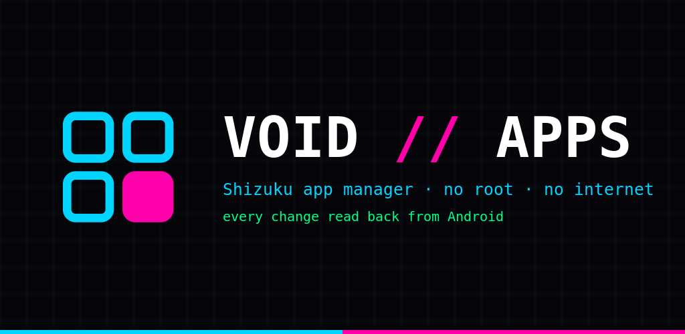

VOID // APPS is a native Kotlin + Jetpack Compose app. Every action is a shell command sent through the [Shizuku](https://shizuku.rikka.app/) UserService as the shell user (uid 2000). After each change it asks Android again and only then reports the result:

| Verdict | Meaning |
|---|---|
| **applied** | the read-back shows the new state |
| **not applied** | the command ran (often with exit 0) but Android kept the old state |
| **unverifiable** | Android offers no way to read this change back |
| **refused** | blocked by the app's own guard, nothing was run |
| **failed** | the command could not run |

The exact command, its output and the before/after state are always one tap away, with Copy and Share.

<table>
  <tr>
    <td width="33%">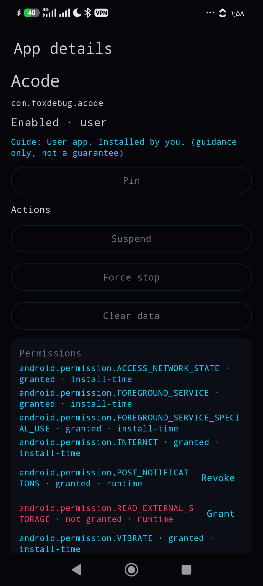</td>
    <td width="33%">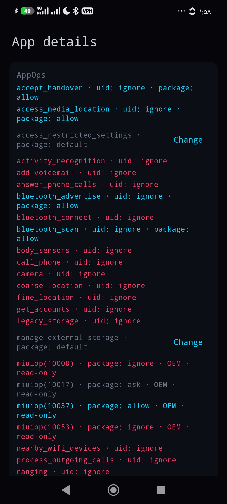</td>
    <td width="33%">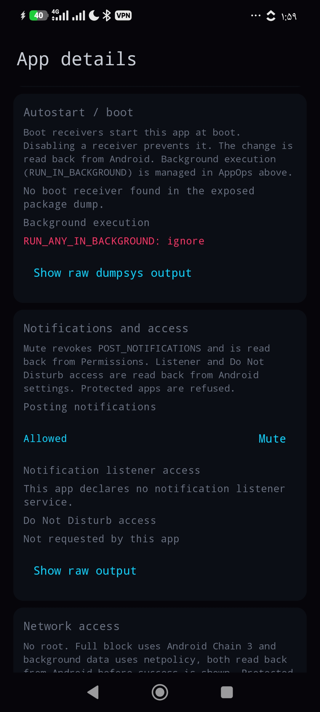</td>
  </tr>
  <tr>
    <td width="33%">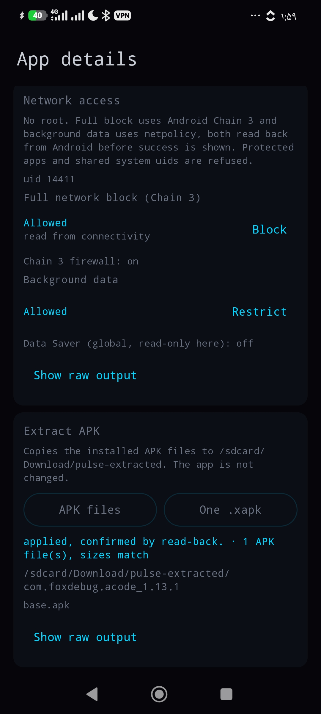</td>
    <td width="33%">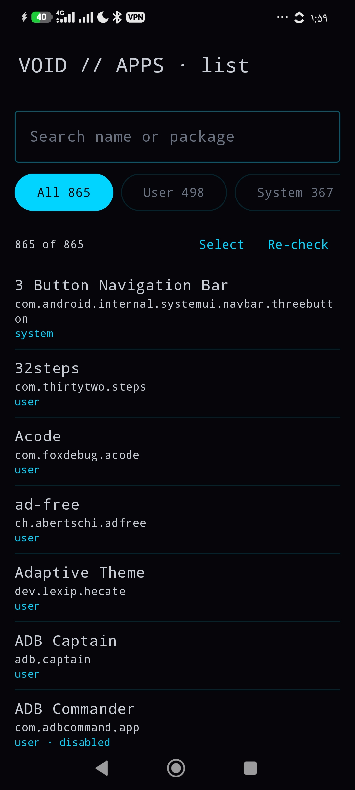</td>
    <td width="33%">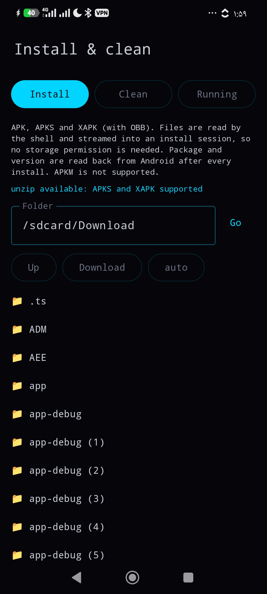</td>
  </tr>
  <tr>
    <td width="33%">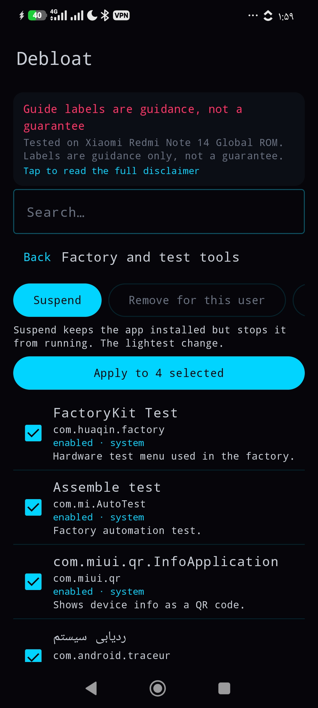</td>
    <td width="33%">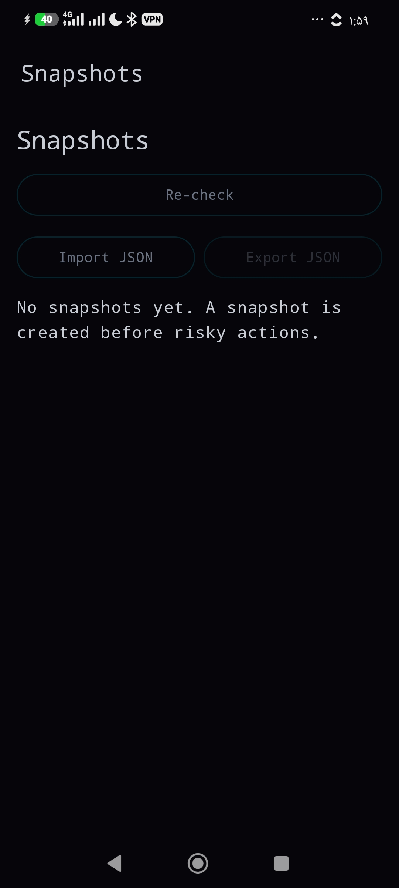</td>
    <td width="33%">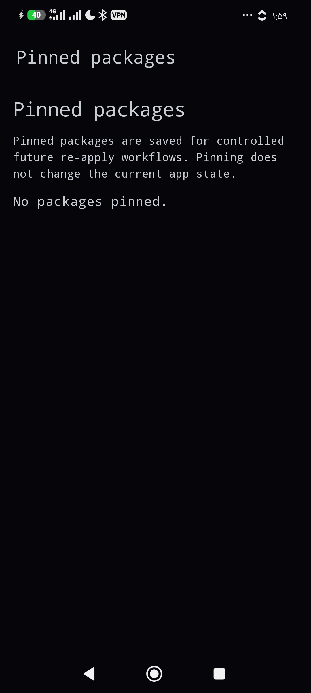</td>
  </tr>
  <tr>
    <td width="33%">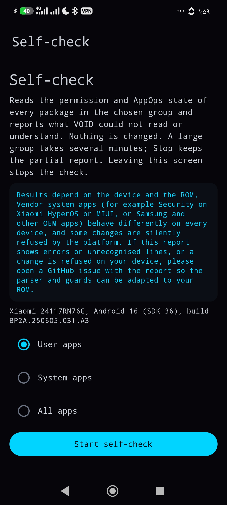</td>
    <td width="33%">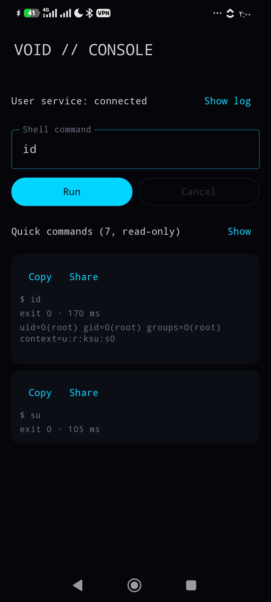</td>
    <td width="33%">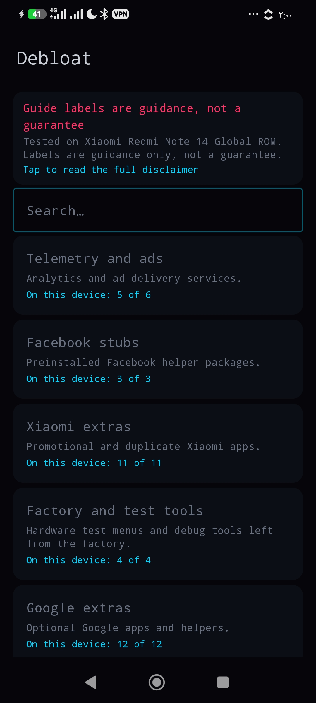</td>
  </tr>
</table>

## What it does

**Apps**
- Full package list for user 0 with search and filters: user, system, disabled, suspended, removed, protected.
- Suspend / unsuspend, disable / enable, force stop, remove for this user, restore (`pm install-existing`, also for packages another manager removed), clear data.
- Snapshots before risky changes, restore with per-package read-back (undo), JSON import and export, pinned packages, batch actions with one snapshot per batch.

**Debloat**
- Presets built from a package knowledge base with Safe / Caution / Core labels, a review screen, search, and a disclaimer that says what it is: guidance tested on one phone, not a guarantee.

**Per-app cards in app details**
- **Permissions**: runtime grant / revoke checked with `pm check-permission`; install-time and fixed permissions shown read-only; shared system uid refused.
- **AppOps**: uid and package scope shown separately; package-scope changes only where no uid mode overrides them; OEM `MIUIOP(n)` modes shown but never written.
- **Autostart**: boot receivers from the Receiver Resolver Table, background execution ops, component disable / enable.
- **Notifications**: mute (POST_NOTIFICATIONS), notification listener access, Do Not Disturb access.
- **Network**: full block through Android 11+ Chain 3 (`cmd connectivity set-package-networking-enabled`), background data through `netpolicy`, shared-uid warning.
- **Extract**: copy the installed base and split APKs, or build one `.xapk`.

**Install & clean**
- Installer for APK, APKS and XAPK with OBB. The shell reads the file from `/sdcard` and streams it into a `pm install-create` session, so the app needs no storage permission. Inspect shows package, version, SDK, ABIs, launcher entry, permissions, SHA-256 and the installed version (with a downgrade warning). A built-in binary-manifest reader gives the package name, which is how an install is verified. Auto-install folder and local history included. APKM is not supported.
- Trim all app caches (free space measured before and after), remove empty folders (`rmdir` only), list apps with live processes and stop them with a fresh process check afterwards.

**Also**: a read-only Self-check for whole package groups, a ROM report template, and a console with read-only quick commands.

## Safety model

- One guard for the whole app (`inventory/ProtectedPackages.kt`). Framework, System UI, Settings, phone and telecom, package installers, permission controller, network stack, Shizuku, the current launcher, keyboard, default dialer, default SMS app and WebView provider are refused **in the repository layer**, not only hidden in the UI.
- Package and component names are validated and every argument is shell-quoted.
- No INTERNET permission. Nothing leaves the phone.
- ExecBridge caps output at 64 KiB; parsers are measured on the phone and a truncated read is treated as "unknown", never as a state.
- A write button appears only where a phone test showed Android really accepts that change.

## Honest limits

- Tested on **one** reference phone: Xiaomi Redmi Note 14, HyperOS Global, Android 16 (SDK 36), Shizuku as uid 2000. Other ROMs can and will differ; the verdicts are built to show that instead of hiding it.
- **Open:** boot receivers listed in shorthand form (`pkg/.Cls`): the device state changes, but the card's button state does not follow yet. See `docs/PLAN.md`.
- **Open:** Do Not Disturb access on HyperOS: `cmd notification allow_dnd` exits 0 and changes nothing. The app reports *not applied*.
- Chain 3 network blocks may not survive a reboot on every ROM.
- Root-only ideas (iptables firewall, app data backup, private cache cleanup) are documented in `docs/ROOT_FUTURE.md`, not implemented.

## Requirements and install

- Android 8.0 or newer.
- [Shizuku](https://shizuku.rikka.app/) running, through wireless debugging, ADB or root.
- Install the APK from Releases (or F-Droid once published), open it, grant the Shizuku permission.

## Build

```sh
cd android-app
gradle :app:testDebugUnitTest :app:assembleDebug
```

JDK 17, Android SDK 36, Gradle 8.13. CI (`.github/workflows/ci.yml`) runs unit tests, lint and the debug build on every push, and a signed release build when the signing secrets exist (see `docs/RELEASE.md`).

## How it was built

The repository started on 2026-08-26 as **Cyber App Manager**, a WebUI module for Shevery. That module was removed from the tree before 1.0.0 and only remains in the git history. The native app was built on the branch `native-app-v0` between **2026-10-02 and 2026-10-05**: 127 commits up to the A8 docs, plus the release commits, 106 of them native-only. Every section was tested on the reference phone as one unit before the next one started. The commit history is left as it happened, including mistakes.

| Phase | Commits | What was hard |
|---|---|---|
| **M0** core | `15eab39`, `f8e4afb`, `9231718`, `3f1020b`, `7848431`, `cca986b` | Build setup, Shizuku runtime and exec core taken over from PULSE // BATTERY. A Shizuku UserService is not an Android Service: it is a binder the Shizuku server creates by reflection, and the bind gives no error when it fails, so the bridge got its own bind log and watchdog. The CI workflow had to be created by hand because the connector cannot write workflow files. |
| **A1** inventory | `8c73166` | The phone printed dates in Persian digits, `cmd role` and the WebView provider query were unknown on HyperOS, and the 64 KiB output cap forced each package list into its own call. Role detection moved to public app APIs. |
| **A2** operations | `2e41051`, `f0b9553`, `5c72a7d`, `f287cfb`, `d8cf9d4` | HyperOS rejects `disable-user` for some system packages; clear data has no read-back and is reported as unverifiable. Two red CI runs before the compile-clean fix. |
| **A3** snapshots, undo, pins, batch | `fdb607e` to `6b3d093` (32 commits) | A pure, testable planner first, then snapshot and pin storage outside app-private data, MediaStore quirks, refresh from package manager read-back, deduplication of rapid snapshots, one snapshot per batch. |
| **Debloat** | `9e8628c`, `4acaa96`, `c8d7dab`, `a9d19f0` | Presets from the knowledge base, review, restore of packages removed by other managers. |
| **A4** permissions, AppOps | `c86a46c` to `077746a` (28 commits) | The hardest section. A Drive dump was 128,886 bytes, system blocks over 100 KiB, all above the cap, so sections are now extracted on the phone first. AppOps lines had prefixes, OEM `MIUIOP` modes, duplicate modes, hidden Packages blocks and shared uids. HyperOS silently kept CAMERA and CALL_PHONE uid-scope changes, so uid-scope writes were turned off and the Self-check was added (311 of 311 system packages clean). |
| **A5** autostart | `07ccf3b`, `84ad3c9`, `91082cb`, `a070171`, `eed9ff5`, `f82f0fb`, `f3c8266` | 14 commits after `077746a` (`0615a61` to `0c93159`, CI #72 to #85) came from a broken AI session and were replaced by a clean rebuild in `07ccf3b`. Then: `pm disable` silently ignored shorthand names (fixed by expanding them), and several read-back attempts failed on the HyperOS dump before an exact `awk` read of the disabled-components block worked. The shorthand UI state is still open. |
| **A6** notifications | `21f03bb`, `b0350d5`, `3b89063` | Ported from the void-pulse module. Mute verified; DND access is silently ignored by HyperOS and reported as such. |
| **A7** network | `f1d5241`, `8d28882` | Ported from the VOID-WALL module. VOID-WALL kept its own list of blocked apps because it had no read-back; here the state is read from Android (`get-package-networking-enabled`). Its netpolicy parser only took the first uid per line; fixed. Verified on user, system and protected apps. |
| **A8** install & clean | `e6bd37c`, `de0efab`, `3d3c9d1`, `ec0a966` | Ported from pulse-install and void-purge. The binary manifest is gzip-compressed on the phone so it fits under the cap. void-purge's "kill background apps" never listed anything: it force-stopped every user app in a background subshell with output thrown away. Rebuilt on `ps` with a per-app check. CI #98 was red only because the commit was half of a two-part push; #99 to #101 are green. |

Detailed evidence for every phase is in `docs/HANDOFF.md`; the roadmap and open items in `docs/PLAN.md`.

## Credits

Commands and behaviour were ported from the author's own phone-tested Shevery modules: [VOID-WALL](https://github.com/kreza6173-pixel/VOID-WALL), [void-pulse](https://github.com/kreza6173-pixel/void-pulse), [void-autostart](https://github.com/kreza6173-pixel/void-autostart), [pulse-install](https://github.com/kreza6173-pixel/pulse-install) and [void-purge](https://github.com/kreza6173-pixel/void-purge). Build and Shizuku core from [PULSE // BATTERY](https://github.com/kreza6173-pixel/pulse-battery). Built on [Shizuku](https://github.com/RikkaApps/Shizuku) by RikkaApps.

## Disclaimer

Disabling or removing the wrong package can break features of your phone, including ones no tool can detect. Labels and presets are guidance from one tested phone, not a guarantee. Snapshots make changes made by this app reversible; use them.

## License

MIT, see [LICENSE](LICENSE).
